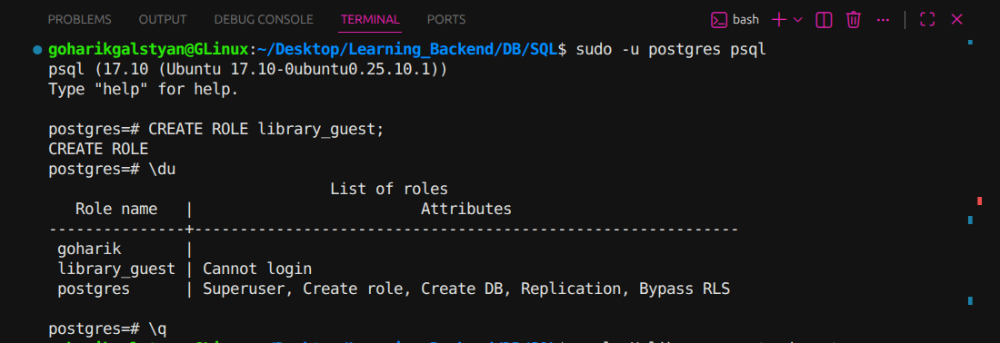
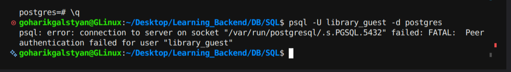

# PostgreSQL Roles: library_guest

## Command used to create the role

```sql
CREATE ROLE library_guest;
```

## Role created with LOGIN disabled



## Failed connection attempt



## Why the connection failed

`library_guest` was created without the `LOGIN` privilege, so it isn't allowed to connect at all. On top of that, the local socket connection uses `peer` authentication, which requires the OS username to match the role name — mine doesn't match `library_guest` either, so PostgreSQL rejected the connection before even checking login rights.