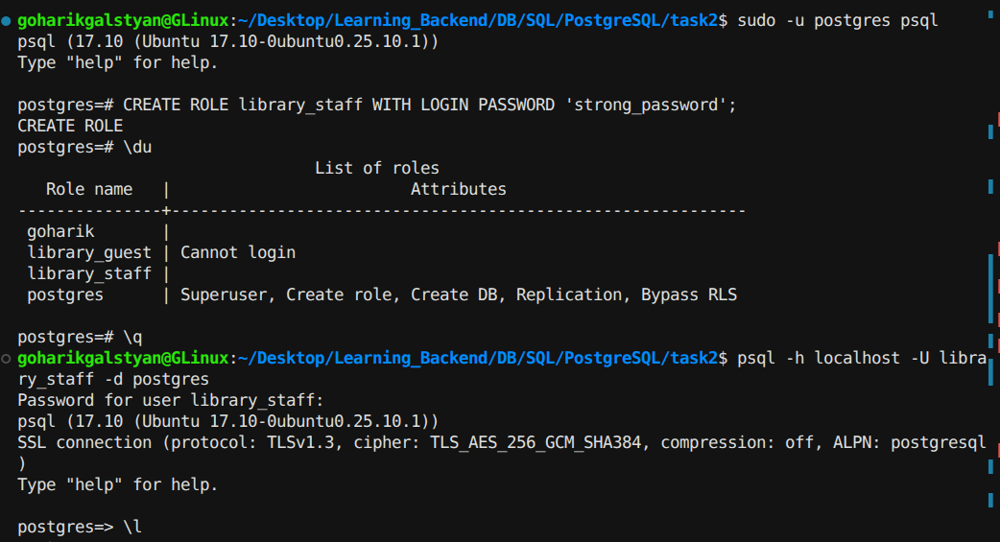
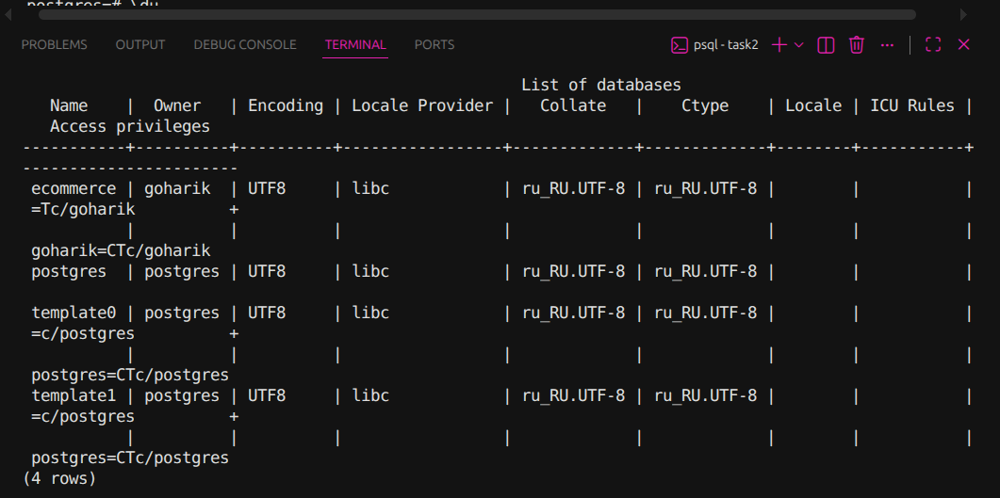

# Task 2: library_staff (LOGIN + password)

## Command used to create the role

```sql
CREATE ROLE library_staff WITH LOGIN PASSWORD 'strong_password';
```

## Successful connection as library_staff



## Listing databases as library_staff

```sql
\l
```



**Observations:** (fill in based on your output — e.g. do you see all databases, or fewer than as superuser? Any difference in the "Access privileges" column?)

## library_guest vs library_staff — comparison

| | library_guest | library_staff |
|---|---|---|
| LOGIN | No (`Cannot login`) | Yes |
| Password | none set | set |
| Can connect via psql? | No — rejected regardless of password | Yes — connects with correct password |

The two roles were created almost identically, except `library_staff` was explicitly given the `LOGIN` attribute and a password. `library_guest` has no `LOGIN` privilege at all, so PostgreSQL refuses any connection attempt before even checking credentials — it's meant to be used as a group/permission role, not for direct sign-in. `library_staff`, on the other hand, behaves like a normal user account: it can authenticate and open a working session, because it has both the permission to log in and a password PostgreSQL can verify.
