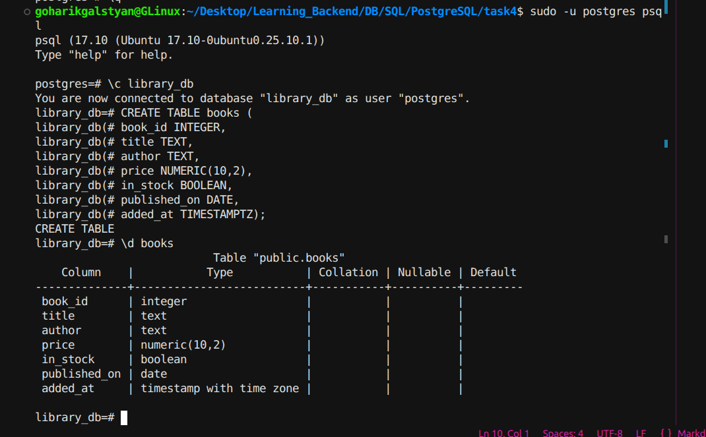

# Creating the `books` Table

## CREATE TABLE statement

```sql
CREATE TABLE books (
    book_id INTEGER,
    title TEXT,
    author TEXT,
    price NUMERIC(10,2),
    in_stock BOOLEAN,
    published_on DATE,
    added_at TIMESTAMPTZ
);
```

## Table structure

Command used:

```
\d books
```



## Type justifications

- **`price` → `NUMERIC(10,2)`**: Money must be stored exactly, and `NUMERIC` avoids the rounding errors that floating-point types (`FLOAT`/`REAL`) can introduce with decimal values.

- **`in_stock` → `BOOLEAN`**: This field only ever holds yes/no, so `BOOLEAN` is the most direct and semantically correct type, rather than encoding it as an integer or character.

- **`added_at` → `TIMESTAMPTZ`**: The field needs to be timezone-aware, and `TIMESTAMPTZ` stores the exact moment in time (converted to/from UTC internally), unlike plain `TIMESTAMP`, which has no timezone context.